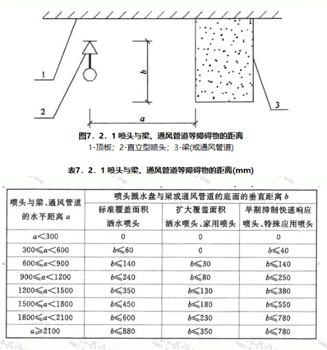
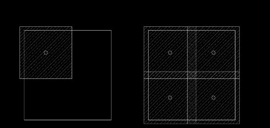
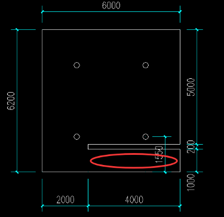
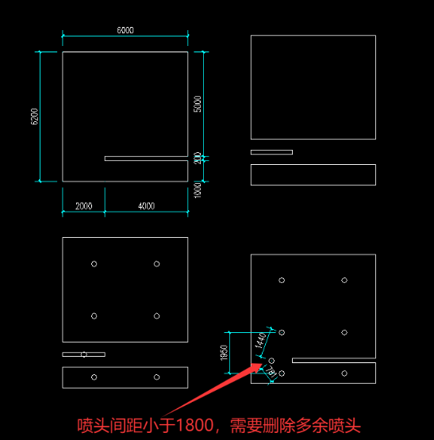
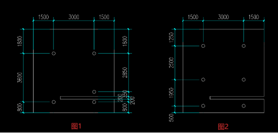

需要实现的目标：

在cad中，基于相关规范的要求，给指定的房间布置若干数量的喷头。

思路：

建立二维坐标系。布置喷头，即求出喷头的坐标。Cad绘图过程中本身就有坐标，可以通过绘图的图层，识别确定房间墙体，再将对应墙体各个端点的坐标点位提取，输入到某个程序（或者插件？），根据规范要求，计算得到所需喷头的坐标。

规范要求：

不同的建筑，对喷头的距离要求不同，因此喷头的距离要求也是一个输入项。

1. 相邻两个喷头之间的距离不小于1800，不大于3400；
1. 能覆盖到墙体的喷头与墙体之间的距离不小于100，不大于1700；

   

   由上述要求可知，喷头的坐标不是唯一解，只需求出满足要求的一组解即可。

   程序需要实现的功能：

   输入任意数量个点的坐标，围合成一个封闭图形（现暂不考虑圆弧和斜边）。输入上述要求的喷头距离（1、2条），得到若干个喷头的坐标点位，即输出一组解。同时输出含有封闭图形和喷头的画面。

   以下思路仅供参考

   思路1：以喷头为中心形成一个2\*1500/1700/1800/2200正方形，若干正方形叠加后全部覆盖封闭图形不留空白即可。需要优化的情况：要是封闭图形如下图，红圈区域按规范是需要再补充喷头的。

   

   思路1示意图

   

   待优化情况

   思路2：将不规整图形拆分成若干个矩形，分别进行计算。但是这样算出来的喷头坐标可能出现相邻的喷头间距小于1800，需要更进一步复核，如下图。

   

   思路3：布置喷头的数量尽可能少，但是不需要追求最优解。喷头排布规则的优先级大于喷头数量少的优先级（非硬性要求）。喷头最小的解是5个喷头（下图1），但是6个喷头的布置更好（下图2）。图1、图2的布置都可。

   
